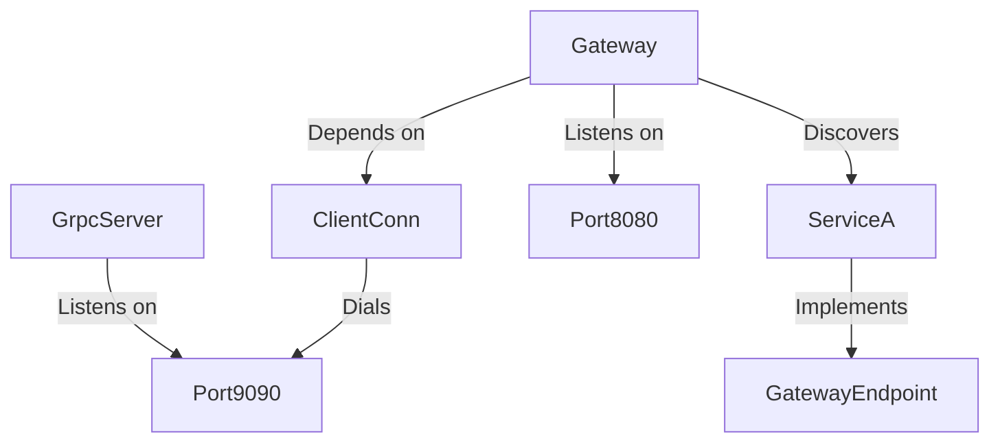

# Architecture Patterns: Server & Transport Layer

**Domain:** Server Framework (gRPC + HTTP Gateway)
**Researched:** Mon Feb 02 2026

## Recommended Architecture

**Decision:** **Port Separation** over `cmux`.

We recommend running gRPC and HTTP Gateway on separate ports (e.g., `:9090` for gRPC, `:8080` for HTTP).

### Rationale
- **Industry Standard:** This is the dominant pattern in modern cloud-native environments (Kubernetes, Service Mesh).
- **Simplicity:** Avoids the complexity and performance overhead of connection multiplexing (L4 sniffing) or HTTP/2 content-type branching.
- **Observability:** Distinct ports allow clearer metrics and health checks for different protocols.
- **Reliability:** `cmux` is less actively maintained and can have compatibility issues with some clients or ALPN configurations.

### Component Boundaries

| Component | Responsibility | Communicates With |
|-----------|---------------|-------------------|
| **GrpcServer** | Hosted gRPC Service | Clients via TCP (gRPC) |
| **Gateway** | HTTP/JSON to gRPC Proxy | Clients via TCP (HTTP) -> GrpcServer (Loopback) |
| **GatewayEndpoint** | Interface for Service Registration | Gateway (via DI) |

### Data Flow

1.  **External Client (HTTP)** -> `Gateway` (:8080)
2.  `Gateway` -> `runtime.ServeMux` -> `grpc.ClientConn` (Loopback)
3.  `grpc.ClientConn` -> **GrpcServer** (:9090)
4.  **GrpcServer** -> `Service Implementation`

## Patterns to Follow

### Pattern 1: Dynamic Interface Discovery
**What:** The Gateway service dynamically discovers and registers all services that wish to expose HTTP endpoints.
**How:** Leverage the Dependency Injection container to find all implementations of `GatewayEndpoint`.

**New DI Capability Required:**
We need to extend `gaz/di` to support **Multi-binding** or **Type Discovery**.
Proposed signature: `func List[T any](c *Container) ([]T, error)`

**Example Implementation:**
```go
// 1. Interface Definition
type GatewayEndpoint interface {
    RegisterGateway(ctx context.Context, mux *runtime.ServeMux, conn *grpc.ClientConn) error
}

// 2. Service Implementation
func (s *UserService) RegisterGateway(ctx context.Context, mux *runtime.ServeMux, conn *grpc.ClientConn) error {
    return userpb.RegisterUserServiceHandler(ctx, mux, conn)
}

// 3. Gateway Service (OnStart)
func (g *Gateway) OnStart(ctx context.Context) error {
    // Discovery
    endpoints, err := di.List[GatewayEndpoint](g.container)
    if err != nil {
        return err
    }
    
    // Registration
    for _, ep := range endpoints {
        if err := ep.RegisterGateway(ctx, g.mux, g.conn); err != nil {
            return err
        }
    }
    
    // Start Server
    return g.server.ListenAndServe()
}
```

### Pattern 2: Loopback Connection
**What:** The Gateway needs a gRPC connection to the local server.
**How:** Inject a `*grpc.ClientConn` configured for `localhost:{grpcPort}`.

## Integration Points

### 1. `gaz` Framework Core
- **Action:** Add `List[T]` (or `ResolveAll[T]`) to `di` package.
- **Refactoring:** Update `App.discoverWorkers` and `App.discoverCronJobs` to use this new primitive, standardizing discovery.

### 2. Dependency Graph

*Note: `Gateway` does not strictly depend on `ServiceA`. It depends on the `GatewayEndpoint` interface. `ServiceA` is resolved lazily or eagerly during discovery.*

## Suggested Build Order

1.  **DI Enhancement:** Implement `di.List[T](c)` in `gaz/di`.
2.  **Gateway Module:** Create `gaz/gateway` package.
    - Define `GatewayEndpoint` interface.
    - Implement `Gateway` service with `OnStart` discovery logic.
3.  **Integration:** Update `App` to expose `List` capability or verify access to Container.

## Anti-Patterns to Avoid

### Anti-Pattern 1: Hardcoded Registration
**What:** Manually registering handlers in the `Gateway` constructor.
**Why bad:** Violates Open-Closed Principle. Adding a new service requires modifying the Gateway code.
**Instead:** Use DI-based discovery (`di.List[T]`).

### Anti-Pattern 2: `cmux` for Production
**What:** Using `cmux` to multiplex gRPC and HTTP on the same port.
**Why bad:** Complexity, potential performance hit, L7 load balancer confusion.
**Instead:** Use separate ports.

## Scalability Considerations

| Concern | Approach |
|---------|----------|
| **Port Exhaustion** | Not an issue with fixed ports (8080, 9090). |
| **Startup Time** | `di.List` iterates all services. With <1000 services, overhead is negligible. |
| **Connection Pooling** | `Gateway` uses a single shared `ClientConn` for all backend calls (gRPC handles multiplexing). |

## Sources

- [gRPC-Gateway Documentation](https://github.com/grpc-ecosystem/grpc-gateway)
- [Uber Go Style Guide](https://github.com/uber-go/guide)
- `gaz` Codebase Analysis (`di/container.go`, `app.go`)
